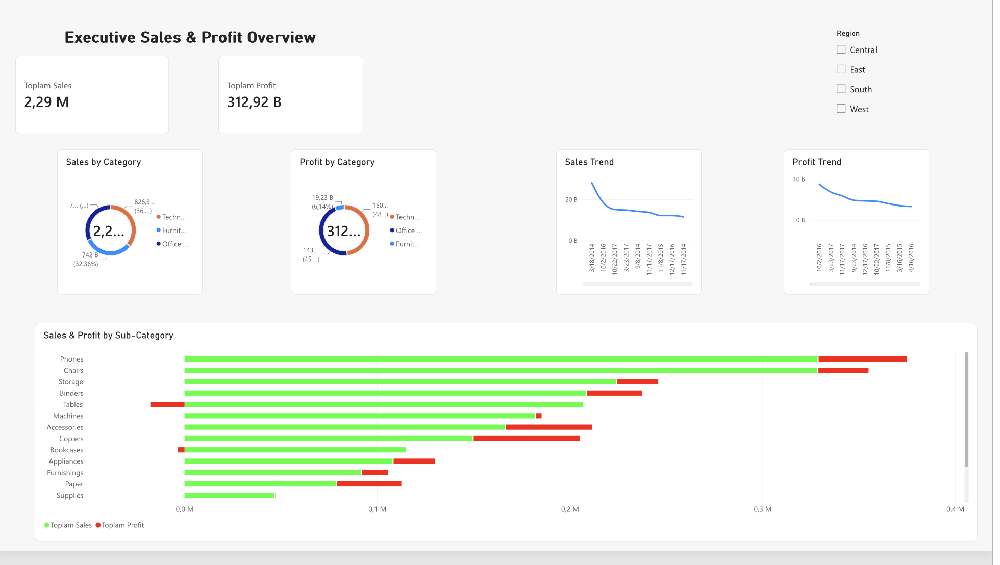

# Executive Sales and Profit Performance Dashboard

An end-to-end Business Intelligence and Data Analysis project analyzing commercial sales performance, regional distributions, and product profitability dynamics using SQL, Excel, and Power BI.

---

## Dashboard Preview

---

## Project Overview and Objective

This project examines retail transaction data to evaluate sales volume versus net profitability across various dimensions including Product Categories, Sub-Categories, Time Trends, and Regions.

The primary business goal is to identify profit-draining segments, monitor revenue health, and provide executive decision-makers with actionable operational insights.

---

## Tech Stack and Workflow

* SQL / SQLite: Data extraction, metric aggregation, and exploratory data queries.
* Microsoft Excel / CSV: Data staging, preparation, and validation.
* Microsoft Power BI: Interactive dashboard design, DAX and visual calculations, dynamic conditional formatting, and UI/UX layout.

---

## Key Business Insights and Findings

* Overall Performance:
  * Total Sales: $2.29M
  * Total Profit: $312.92K
* Profitability Gaps (High Risk Areas):
  * Despite strong sales volumes, Tables and Bookcases exhibit negative profit margins (net losses), highlighting urgent pricing, discount, or supply chain restructuring needs.
* Top Profit Drivers:
  * Technology and Office Supplies drive the majority of operating income, maintaining sustainable margins.
* Regional and Temporal Trends:
  * Performance varies across regions (Central, East, South, West), with distinct seasonality visible in long-term sales and profit trajectories.

---

## Repository Contents

* dashboard.png: High-resolution dashboard view.
* dashboard.pdf: Full dashboard report export.
* queries.sql.sqbpro: SQL project queries and aggregations.
* superstore.db: SQLite database file.
* Sample Superstore .csv: Raw retail sales dataset.
